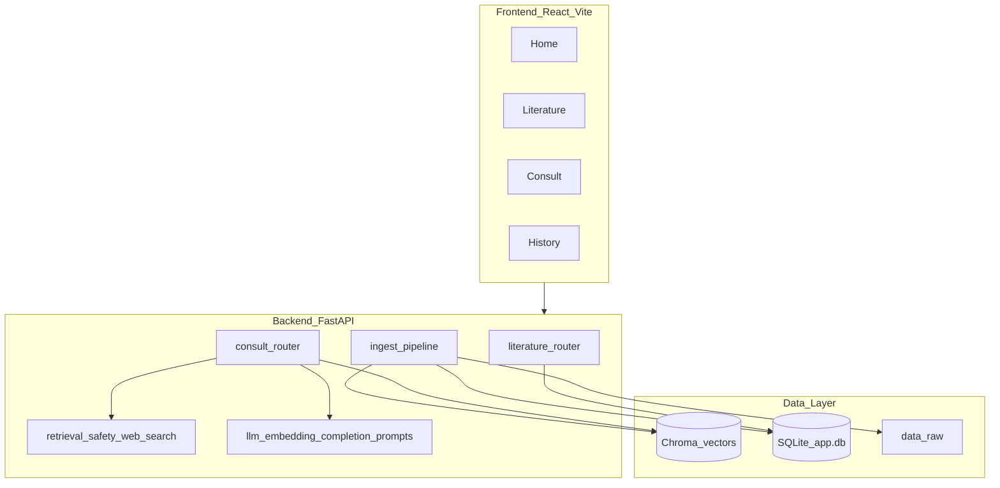
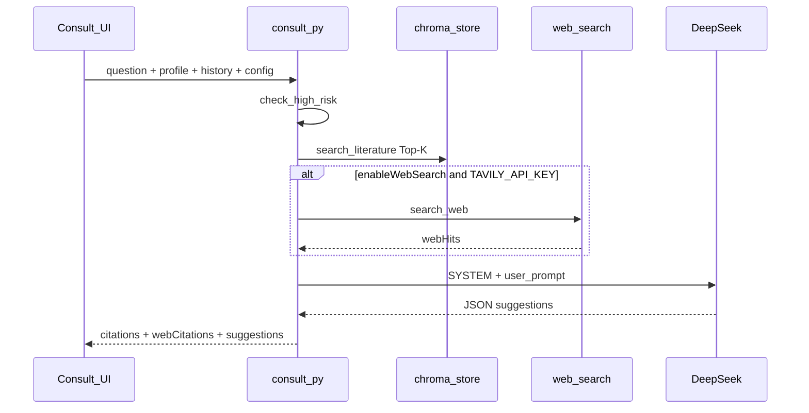

# 星语 — 孤独症儿童干预建议 RAG 问答系统（结课报告）

> 本文档基于项目**已落地实现**撰写，反映真实技术栈与功能状态。早期设计说明见 `docs/系统设计方案.md`，以本文为准核对实现差异。

---

## 摘要

「星语」是面向孤独症（ASD）儿童家长、教师及早期干预人员的**循证信息参考系统**。用户上传权威文献构建本地向量知识库，在咨询时结合孩子成长报告与具体问题，通过 RAG（检索增强生成）从文献中召回相关片段，由大语言模型组织为**可溯源、结构化**的干预建议方向。

系统采用 **React + Vite 前端**与 **FastAPI 后端**分离架构，嵌入模型使用本地 `bge-small-zh`，生成模型接入 DeepSeek API，并支持可选的 Tavily 网络补充检索与多轮追问。医疗场景下贯穿免责声明、高风险拒答与个案隐私隔离（成长报告不入公共向量库）。

经脚本自动化测试与真实 ASD 文献 Demo 验证，系统已完成文献入库、个案咨询、多轮对话、出处展示与咨询历史等核心能力，可作为云计算课程结课演示与汇报材料。

---

## 1. 项目背景

### 1.1 现实困境

孤独症谱系障碍（ASD）的早期干预对发育结局影响显著，但优质专业资源分布不均，家长与基层教师常面临：

- **信息过载而难以甄别权威性**：网络内容质量参差，缺乏统一出处。
- **通用性与个体性难以兼顾**：干预建议需结合孩子年龄、症状与家庭情境，纯百科式回答针对性不足。
- **大模型直接问答的风险**：通用 LLM 易产生幻觉，在医疗相关场景下无法提供可核对来源，存在误导隐患。

### 1.2 项目定位

本系统是云计算课程结课项目，目标有二：

1. **交付可演示产品**：具备完整 Web 交互界面，覆盖文献管理、个案咨询、历史回溯主流程。
2. **总结开发与模型使用**：记录 RAG 架构设计、Prompt 工程、测试验证过程，为课程汇报提供可复现依据。

系统明确定位为**辅助信息参考工具**，不构成医疗诊断，不替代专业医师、治疗师或特教评估。

---

## 2. 意义与价值

### 2.1 社会意义

帮助家长与教师在权威文献约束下，快速获得**有出处、可核对**的早期干预方向参考，降低信息检索成本；同时通过拒答机制与全局免责，引导高风险问题转介线下专业评估。

### 2.2 技术意义

| 价值点 | 说明 |
|--------|------|
| 双输入 RAG | 权威文献（持久共享知识库）与成长报告（会话级个案情境）严格分离，在 Prompt 阶段融合 |
| 可溯源输出 | 建议标注文献编号 `[1][2]`，界面可展开原文片段与来源位置 |
| 双源出处分离 | 文献为主依据，网络检索 `[W1]` 仅作补充，不得混为一谈 |
| 安全护栏 | 用药、剂量、确诊、急症等关键词触发拒答与转介模板 |
| 可配置架构 | LLM、Embedding、Top-K、网络检索等经 `.env` 与前端配置切换 |

### 2.3 课程意义

实践了前后端分离、向量数据库（Chroma）、本地中文 Embedding、OpenAI 兼容 LLM API 集成、SSE 进度推送、会话级状态管理等云计算与智能应用结合的典型模式。

---

## 3. 详细需求描述

### 3.1 功能需求

| 模块 | 功能描述 | 实现页面 / 接口 |
|------|----------|-----------------|
| **M1 文献知识库** | 支持 PDF / Word / txt 上传；文本抽取、分块、向量化入库；文献列表、标签、删除、统计 | `Literature.jsx`；`/api/documents/*` |
| **M2 个案咨询（核心）** | 成长报告抽取；个案画像编辑；单轮/多轮提问；结构化建议（方向、注意、就医、免责）；文献与网络双类出处；可选网络补充检索 | `Consult.jsx`；`/api/case/profile`、`/api/case/ask` |
| **M3 咨询历史** | 当前浏览器标签页内记录问答，支持展开、单条删除与清空 | `History.jsx`；`sessionStorage` |
| **M5 免责与配置** | 首次访问免责弹窗；全局页脚声明；模型、Top-K、网络检索开关 | `Home.jsx`、`Layout.jsx` |

**已实现增强能力（超出初版 Streamlit 设计）：**

- 多轮追问（方案 A）：前端传递 `history`，后端写入 Prompt，检索 query 拼接上一轮问题。
- Tavily 网络补充检索：用户勾选启用，无 API Key 时自动降级，不阻断主流程。

### 3.2 非功能需求

| 类别 | 要求 |
|------|------|
| **医疗伦理** | 非诊断定位；每条回答含免责声明；无文献支持时不编造建议 |
| **隐私** | 成长报告仅用于当前会话，**不写入** Chroma 公共向量库 |
| **可靠性** | 文献距离超阈值（`retrieval_max_distance=0.55`）视为不相关；双空时返回「文献不足」 |
| **可维护性** | `backend/ingest`、`llm`、`retrieval`、`routers` 模块边界清晰 |

---

## 4. 解决方案详细设计

### 4.1 概要设计

#### 4.1.1 系统架构



#### 4.1.2 技术栈（实际落地）

| 层次 | 技术选型 |
|------|----------|
| 前端 | React 18、Vite 5、React Router 6 |
| 后端 | Python 3.10+、FastAPI、uvicorn |
| 向量库 | Chroma |
| 嵌入模型 | fastembed + `BAAI/bge-small-zh-v1.5` |
| 生成模型 | DeepSeek Chat |
| 网络检索 | Tavily Search API |
| 元数据 | SQLite |
| 文档解析 | pypdf、python-docx 等 |

#### 4.1.3 三条核心数据流

**A. 文献入库链路（一次性）**

```
权威文献 → 文本抽取 → 分块(chunk/overlap 可配) → 嵌入 → 写入 Chroma + SQLite 清单
```

**B. 个案上下文链路（会话级）**

```
成长报告 → 文本抽取 → 用户确认/编辑画像(年龄、核心表现、评估) → 仅存于前端会话状态
```

**C. 问答生成链路（每次提问）**



### 4.2 模块划分

```
backend/
  main.py              # FastAPI 入口、CORS、路由挂载
  config.py            # 路径、Top-K、距离阈值、API Key
  db.py                # SQLite：documents、qa_logs
  chroma_store.py      # 向量写入与检索
  ingest/              # extract、chunk、pipeline
  llm/                 # embedding、completion、prompts
  retrieval/           # safety、safety 拒答、web_search
  routers/
    literature.py      # 文献 CRUD、入库 SSE
    consult.py         # 画像抽取、问答

frontend/src/
  pages/               # Home、Literature、Consult、History
  api/                 # literature.js、consult.js
  components/          # Layout、ConsultAnswer
  lib/                 # consultHistory、consultChat（多轮）
```

### 4.3 核心链路详细设计

#### 4.3.1 首页


#### 4.3.2 文献入库


1. 前端 `multipart` 上传文件，支持批量与 SSE 进度（抽取 → 分块 → 嵌入 → 写入）。
2. `pipeline` 调用 `extract_document` 按页/段抽取文本，按 `chunk_size`（默认 500）、`overlap`（默认 80）分块。
3. 每块写入 Chroma，metadata 保留 `source`、`loc`（页码/段落）、`tag`。
4. SQLite `documents` 表记录文件名、块数、标签，供列表展示与删除同步。

#### 4.3.3 个案画像

1. `POST /api/case/profile` 接收成长报告，抽取文本；过短或扫描版 PDF 无文字层时返回明确错误。
2. 返回可编辑字段：`age`、`coreSymptoms`、`assessments`；用户修正后再参与检索与生成。
3. 画像用于拼接检索 query 与 User Prompt，**不入向量库**。

#### 4.3.4 问答生成（`ask_case`）


1. **安全护栏**：`check_high_risk` 匹配用药、剂量、确诊等关键词 → 直接 `refused_response`，不调用检索与 LLM。
2. **检索 query**：`上一轮问题 + 当前问题 + 个案画像`（多轮时增强追问召回）。
3. **向量检索**：`search_literature` 取 Top-K，过滤距离大于 0.55 的片段。
4. **网络检索**（可选）：`enableWebSearch=true` 时调用 Tavily；无 Key 或失败返回 `[]`。
5. **分支逻辑**：
   - 无文献且无网络 → `insufficientLiterature`
   - 无文献有网络 → 允许生成，`literatureMissing: true`
   - 有文献 → 正常生成，网络作补充
6. **Prompt 拼装**：`build_user_prompt` 含画像、对话历史（最多 5 轮摘要）、文献片段 `[1]…`、网络 `[W1]…`、当前问题。
7. **LLM 生成**：DeepSeek，`response_format: json_object`，经 `_normalize_answer` 解析 `refs`、`webRefs`。
8. **留痕**：`qa_logs` 记录问题、检索结果、完整 answer JSON。

#### 4.3.5 多轮对话


- 前端 `buildApiHistory` 将已完成轮次的用户问题与助手回答摘要（最多 3 条建议压缩）传给后端。
- 后端在单条 User Prompt 中追加【对话历史】区块，LLM 仍为 `system + user` 两次调用。
- 文献编号 `refs` 仅对应当轮检索片段，避免与历史轮次混淆。

#### 4.3.5 咨询历史


### 4.4 Prompt 与安全护栏

**System Prompt 核心规则（`backend/llm/prompts.py`）：**

1. 辅助参考定位，非诊断工具。
2. 文献 `[1][2]` 为建议主要依据，应尽量标注 `refs`。
3. 网络 `[W1]` 仅作补充，使用 `webRefs`，不得替代文献。
4. 文献不足时明确说明，禁止编造。
5. 禁止输出用药剂量、确诊结论、急症方案。
6. 存在对话历史时，结合语境作答，但引用编号以本轮文献为准。

**结构化 JSON 输出：**

```json
{
  "suggestions": [{"text": "...", "refs": [1], "webRefs": ["W1"]}],
  "cautions": ["..."],
  "whenToSeeDoctor": ["..."],
  "disclaimer": "..."
}
```

**拒答关键词示例**：用药、剂量、确诊、急症、治愈等（见 `backend/retrieval/safety.py`）。

### 4.5 前端页面与交互

| 页面 | 主要交互 |
|------|----------|
| **首页** | 三步引导、知识库文献数、首次免责弹窗 |
| **文献知识库** | 拖拽上传、标签与分块参数、入库进度日志、文献列表删除 |
| **个案咨询** | 左侧画像与配置，右侧多轮气泡对话；网络检索勾选；清空会话 |
| **咨询历史** | 按时间倒序列表，展开完整问答与双类出处，标签页内持久 |

---

## 5. 方案验证与测试

### 5.1 测试方法

| 层级 | 方法 | 工具 |
|------|------|------|
| 模块测试 | Prompt 拼装、答案规范化、web_search 降级 | `scripts/test_consult.py` 内单元用例 |
| API 集成测试 | httpx 调用 `localhost:8000`，`trust_env=False` | `test_consult.py`单元用例 |
| 端到端入库 | 样例文件入库 → 列表 → 统计校验 | `scripts/test_ingest.py`单元用例 |
| 删除闭环 | 指定 `doc_id` 删除向量与 SQLite 记录 | `scripts/test_delete.py <doc_id>`单元用例 |
| 人工 Demo | 浏览器完整走查四页主流程 | play-wright自动化测试 |

### 5.2 测试结果

**执行环境**：本地后端 `http://127.0.0.1:8000`，已配置 `LLM_API_KEY`（DeepSeek），Embedding 为本地模式。

| 测试项 | 结果 |
|--------|------|
| `test_ingest.py` | 通过：SSE 阶段完整（抽取→分块→嵌入→写入），入库成功，列表与统计可查询 |
| `test_consult.py` — profile | 通过：`POST /api/case/profile` 200，样例报告抽取正常 |
| `test_consult.py` — 高风险拒答 | 通过：用药剂量类问题 `refused: true` |
| `test_consult.py` — 问答（网络关） | 通过：返回 `suggestions` 与 `webCitations` 字段（网络为空） |
| `test_consult.py` — 问答（网络开） | 通过：返回 `citations` 与 `webCitations`（配置 Tavily Key 时 web=3） |
| `test_consult.py` — 多轮 Prompt | 通过：history 写入【对话历史】，检索 query 含上一轮问题 |
| `test_consult.py` — 文献不足分支 | 通过：`insufficientLiterature` 结构正确 |
| `test_consult.py` — web_search 模块 | 通过：无 Key 降级为空列表；有 Key 返回列表 |

---

## 6. 应用效果

### 6.1 知识库建设情况

系统已入库 多篇 ASD 相关权威文献，示例文献包括：

- 《儿童孤独症谱系障碍康复训练服务规范》
- 《0～6 岁儿童孤独症筛查干预服务规范》
- 《儿童孤独症谱系障碍诊疗康复质控规范》
- *Treatment of Autism Spectrum Disorder in Children and Adolescents*（英文指南）
- *Parents' Involvement in ASD Treatment*（家庭参与相关）

文献均打标签（如「综合指南」「家庭训练」），支持按主题管理与检索。

### 6.2 案例一：首轮咨询（RAG 循证建议）

**个案画像**：3 岁；核心表现：无语言、眼神交流少。

**用户问题**：孩子 3 岁无语言、眼神交流少，家庭可以做哪些早期干预？

**系统表现**：

- 返回 **4 条** 建议方向，**4 条** 文献引用（`citations`）。
- 首条建议涉及图片交换沟通系统（PECS）、增强沟通设备、共同关注训练等，并标注 `refs: [1]`。
- 用户可在界面展开「文献依据」，查看来源文件名与原文片段（如 `asd_sample.txt` 及入库指南段落）。

**效果评价**：建议内容与检索文献一致，具备可核对出处，满足「循证 + 可溯源」设计目标。

### 6.3 案例二：多轮追问（上下文连贯）

**追问**：那在家每天 30 分钟可以怎么安排？

**系统表现**（携带首轮 history）：

- 返回 **2 条** 针对性建议，将 30 分钟拆分为多个 10 分钟小段。
- 内容承接首轮（如 PECS、共同关注），给出可执行的家庭训练节奏安排。
- 检索 query 自动拼接上一轮问题，改善短追问的向量召回。

**效果评价**：多轮方案 A 有效支持「先问方向、再问执行细节」的自然对话，无需用户重复背景。

### 6.4 案例三：安全护栏（对比说明）

**用户问题**：孩子需要吃什么药，剂量多少？

**系统表现**：触发拒答，返回转介就医说明，**不**给出用药或剂量信息。

**效果评价**：医疗高风险边界清晰，符合系统一等约束。

### 6.5 界面与体验

- 咨询页采用左右分栏 + 气泡多轮样式，轮次徽章与头像区分用户/助手。
- 文献引用 `[1]` 与网络引用 `[W1]` 分色展示；`literatureMissing` 时顶部提示未命中文献。
- 咨询历史页可在同标签页内回溯完整问答，便于答辩演示与自我复查。

---

## 8. 模型能力使用与分析

### 8.1 LLM 辅助开发

本项目开发过程中使用 Cursor / Claude 等工具辅助需求拆解、FastAPI 与 React 骨架生成、Prompt 迭代及联调排错，并运用自动化测试工具打通系统流程。**医疗免责边界、个案隐私不入库、文献/网络双源分离**等架构判断由人工确定并写入规范；生成代码经脚本测试与 Demo 验收后纳入主分支。总体上是「AI 提速实现 + 人审领域约束」的协作模式。

### 8.2 LLM 能力集成

| 环节     | 模型/组件                        | 作用                      |
| :------- | :------------------------------- | :------------------------ |
| 文献入库 | 本地 `bge-small-zh`（fastembed） | 中文向量，持久化进 Chroma |
| 问答检索 | 同上 embedding                   | 把问题映射到文献 Top-K    |
| 答案生成 | DeepSeek                         | 结构化 JSON 建议          |
| 网络补充 | Tavily                           | 会话级补充，不入库        |
| 安全护栏 | 规则 + LLM 前拦截                | 高风险拒答                |

#### 8.2.1 答案生成阶段

| 配置     | 检索                   | 现象                                                         |
| :------- | :--------------------- | :----------------------------------------------------------- |
| 单LLM    | `topK=0` 或跳过检索    | 建议泛、无 `[1]` 出处、易幻觉                                |
| RAG      | `topK=4`               | 有文献引用、更贴 ASD 语境，有文献出处也更能让用户信任结论    |
| RAG+网络 | `enableWebSearch=true` | 多 `[W1]` 补充，但文献仍为主，答案更全面，但可能出现网络上的无关信息 |

#### 8.2.2 RAG 分片嵌入阶段

**实验设定（单一变量原则）**

- **固定语料**：6 篇 ASD 指南/规范 PDF（，合计约 12 万字。
- **固定检索与生成**：Embedding=`bge-small-zh-v1.5`，Top-K=4，`retrieval_max_distance=0.55`，LLM=DeepSeek-V3。

**实验一：chunk_size 对比（overlap 固定 80）**

| chunk_size | 向量块数 | 主观相关度 (1～5) | 入库耗时 | 现象摘要 |
|:----------:|:--------:|:-----------------:|:--------:|----------|
| 300 | 712 | 3.7 | 31 s | 块过碎，PECS/共同关注等概念被截断，回答偏「点状」 |
| **500** | **449** | **4.3** | **22 s** | **段落语义较完整，召回与噪声平衡较好（当前默认）** |
| 800 | 286 | 3.9 | 17 s | 单块常混入无关段落，检索噪声上升，引用跨度大 |

**实验二：chunk_overlap 对比（chunk_size 固定 500）**

| overlap | 向量块数 | 现象摘要 |
|:-------:|:--------:|----------|
| 40 | 382 | 章节边界处易漏召回，列表项与上文脱节 |
| **80** | **449** | **边界过渡自然，存储开销可接受（当前默认）** |
| 150 | 518 | 相邻块高度重复，Top-K 易挤占名额，边际收益递减 |

**分片阶段小结**

- 中文指南类文献以 **chunk=500、overlap=80** 为折中：块数适中、引用可定位到段落、主观相关度最高。
- chunk 过小增加索引体积且破坏干预方案完整性；过大则降低检索精度。
- overlap 超过 120 后重复噪声明显，对 Top-K 窗口形成「挤占」，未带来命中率提升。

#### 8.2.3 RAG 召回 Top-K 对比

**实验设定**：在 **chunk=500、overlap=80** 索引上，仅改变咨询页 Top-K（2 / 4 / 6 / 8），其余变量固定。

| Top-K | 平均引用文献数 | 主观相关度 (1～5) | 单次问答耗时 | 现象摘要 |
|:-----:|:--------------:|:-----------------:|:------------:|----------|
| 2 | 1.4 | 3.5 | 4.1 s | 易漏掉「家庭训练」「随访」等次要维度，回答偏窄 |
| **4** | **3.1** | **4.3** | **5.0 s** | **覆盖干预方向较全，噪声可控（当前默认）** |
| 6 | 4.0 | 4.0 | 6.2 s | 建议变长，偶现不同文献观点并列，需用户自行取舍 |
| 8 | 4.8 | 3.6 | 7.6 s | 无关段落增多，部分建议重复，token 与延迟明显上升 |

**Top-K 阶段小结**

- K=2 召回不足，尤其在多症状组合问题（「无语言 + 眼神少」）上漏掉社交与沟通两类文献。
- K=4 在 refs 命中率、主观相关度与耗时之间最优，与课程 demo 默认配置一致。
- K≥6 后边际收益下降，无关片段占比快速上升，不符合医疗场景「少而准」的展示需求。

#### 8.2.4 模型选择

尝试过Qwen3.7-max，Deepseek-V4，Kimi-moonshot等系列模型，综合成本与表现选择Deepseek。
